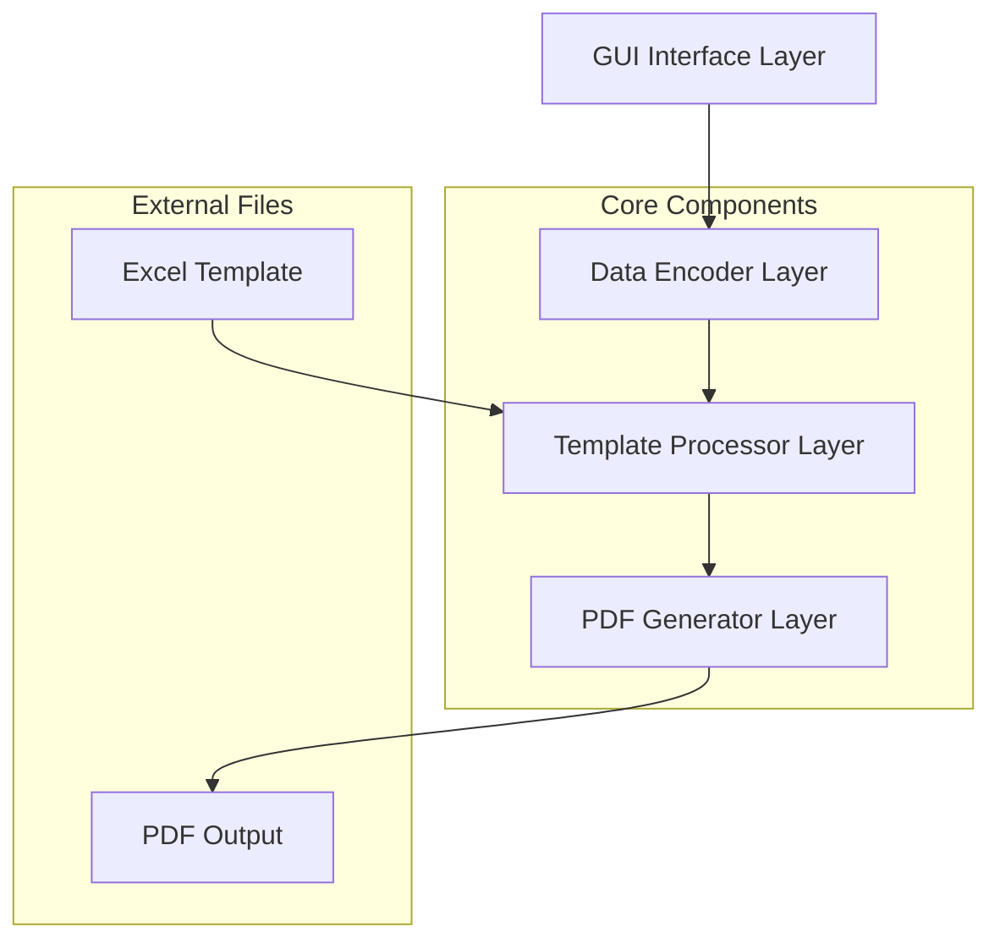

# Design Document: Leave Application Encoder System

## Overview

The Leave Application Encoder System is a Python-based desktop application that automates the data entry process for Civil Service Form No. 6 (Revised 2020) leave applications. The system preserves the exact Excel template layout while providing a streamlined GUI interface for data entry and generates pixel-perfect PDF outputs that maintain identical formatting to the original Excel template.

### Core Design Principles

1. **Template Preservation**: Maintain the exact layout, formatting, and structure of the original Excel template
2. **Minimal Automation**: Provide just enough automation to reduce repetitive tasks without over-engineering
3. **Layout Fidelity**: Ensure PDF outputs are visually identical to the Excel template for professional submission
4. **Simplicity**: Use straightforward Python libraries and patterns for maintainability

### Technology Stack

- **GUI Framework**: tkinter (Python standard library, no external dependencies)
- **Excel Processing**: openpyxl (Excel file manipulation without Excel installation)
- **PDF Generation**: reportlab + openpyxl (for maintaining exact layout fidelity)
- **Date Handling**: datetime (Python standard library)

## Architecture

The system follows a layered architecture with clear separation of concerns:



### Architecture Layers

1. **GUI Interface Layer**: Handles user interaction, input validation, and display
2. **Data Encoder Layer**: Manages data transformation and field mapping
3. **Template Processor Layer**: Handles Excel template loading and manipulation
4. **PDF Generator Layer**: Creates print-ready PDF outputs with exact layout preservation

### Data Flow

1. User launches application → GUI loads template metadata
2. User enters data → Data validation occurs in real-time
3. User clicks "Generate PDF" → Data flows through encoder to template processor
4. Template processor populates Excel working copy → PDF generator creates output
5. PDF saved with preserved layout and formatting

## Components and Interfaces

### 1. GUI Interface Component (`gui_interface.py`)

**Responsibilities:**
- Display main application window with input fields
- Handle user interactions and events
- Provide real-time data validation feedback
- Manage calendar widgets and dropdown selections

**Key Classes:**
```python
class LeaveApplicationGUI:
    def __init__(self)
    def create_widgets(self)
    def validate_inputs(self) -> bool
    def on_generate_pdf(self)
    def show_error(self, message: str)
```

**Interface Methods:**
- `display_main_window()`: Shows the primary data entry interface
- `get_user_inputs()`: Retrieves all form data as structured dictionary
- `validate_form_data()`: Performs comprehensive input validation
- `show_validation_errors()`: Displays validation feedback to user

### 2. Data Encoder Component (`data_encoder.py`)

**Responsibilities:**
- Transform GUI inputs into Excel cell mappings
- Handle date format conversions and calculations
- Validate data integrity and business rules
- Manage working days calculations

**Key Classes:**
```python
class DataEncoder:
    def __init__(self, template_processor)
    def encode_form_data(self, user_inputs: dict) -> dict
    def calculate_working_days(self, start_date, end_date) -> int
    def validate_date_range(self, dates: list) -> bool
```

**Interface Methods:**
- `encode_user_data()`: Converts GUI inputs to Excel cell coordinates
- `validate_business_rules()`: Ensures data meets form requirements
- `format_dates()`: Standardizes date formats for Excel and PDF

### 3. Template Processor Component (`template_processor.py`)

**Responsibilities:**
- Load Excel template without modification
- Create working copies for data population
- Map data to specific Excel cells
- Preserve all formatting and layout elements

**Key Classes:**
```python
class TemplateProcessor:
    def __init__(self, template_path: str)
    def load_template(self) -> Workbook
    def create_working_copy(self) -> Workbook
    def populate_fields(self, data_mapping: dict)
```

**Cell Mapping Strategy:**
```python
CELL_MAPPINGS = {
    'name': 'B8',
    'position': 'B9', 
    'date_filing': 'G8',
    'inclusive_dates': 'B12',
    'working_days': 'G12'
}
```

### 4. PDF Generator Component (`pdf_generator.py`)

**Responsibilities:**
- Convert populated Excel to PDF with identical layout
- Preserve checkboxes as interactive elements
- Maintain exact spacing, fonts, and formatting
- Generate A4-sized output for printing

**Key Classes:**
```python
class PDFGenerator:
    def __init__(self, template_processor)
    def generate_pdf(self, populated_workbook, output_path: str)
    def preserve_layout(self, worksheet) -> dict
    def convert_checkboxes(self, worksheet)
```

**Layout Preservation Strategy:**
- Extract exact cell positions and dimensions from Excel
- Map Excel fonts and formatting to PDF equivalents
- Preserve checkbox states and interactivity
- Maintain precise spacing for A4 printing

## Data Models

### User Input Model
```python
@dataclass
class LeaveApplicationData:
    name: str
    position: str
    date_filing: datetime.date
    inclusive_dates: List[datetime.date]
    working_days: int
    
    def validate(self) -> List[str]:
        """Returns list of validation errors"""
        pass
```

### Excel Cell Mapping Model
```python
@dataclass
class CellMapping:
    field_name: str
    cell_address: str
    data_type: str  # 'text', 'date', 'number'
    format_string: Optional[str] = None
```

### Template Metadata Model
```python
@dataclass
class TemplateMetadata:
    template_path: str
    version: str
    cell_mappings: Dict[str, CellMapping]
    checkbox_positions: List[str]
    
    @classmethod
    def load_from_template(cls, template_path: str):
        """Extract metadata from Excel template"""
        pass
```

### PDF Layout Model
```python
@dataclass
class PDFLayout:
    page_width: float
    page_height: float
    cell_positions: Dict[str, Tuple[float, float]]
    font_mappings: Dict[str, str]
    checkbox_coordinates: List[Tuple[float, float]]
```
## Correctness Properties

*A property is a characteristic or behavior that should hold true across all valid executions of a system-essentially, a formal statement about what the system should do. Properties serve as the bridge between human-readable specifications and machine-verifiable correctness guarantees.*

### Property 1: Template Integrity Preservation

*For any* Excel template processing operation, the original template file should remain completely unchanged, with all formatting, checkboxes, and field positions preserved exactly as they were before processing.

**Validates: Requirements 1.1, 1.2, 1.3, 1.4, 3.3, 7.2, 7.3**

### Property 2: Date Format Processing

*For any* valid date range format (single dates, consecutive ranges, non-consecutive dates), the system should correctly parse and process the dates while maintaining the original format representation in the output.

**Validates: Requirements 1.5, 5.1, 5.2, 5.3, 5.4**

### Property 3: Working Days Calculation

*For any* date range input, the calculated working days should accurately reflect the actual number of working days in that period, excluding weekends and handling various date formats correctly.

**Validates: Requirements 5.5**

### Property 4: PDF Layout Fidelity

*For any* populated Excel template, the generated PDF should maintain identical positioning, formatting, fonts, and interactive elements (checkboxes) as the original Excel template, formatted for A4 printing.

**Validates: Requirements 4.2, 4.3, 4.4, 4.5, 8.1, 8.2, 8.3, 8.4**

### Property 5: Data Validation Completeness

*For any* invalid input data (empty required fields, incorrect date orders, mismatched working days), the system should detect the validation errors and prevent PDF generation until all issues are resolved.

**Validates: Requirements 6.1, 6.2, 6.3, 6.4, 6.5**

### Property 6: Automatic Field Population

*For any* application startup, the Date Filing field should automatically populate with the current system date in the correct format.

**Validates: Requirements 2.5, 3.1**

### Property 7: PDF File Generation

*For any* valid form data, clicking the Generate PDF button should create a file named exactly "Application_for_Leave.pdf" in the specified output location.

**Validates: Requirements 4.1**

### Property 8: Template File Dependency

*For any* system operation, the system should use only the single ALA.xlsx template file and verify its existence and accessibility before proceeding with any processing.

**Validates: Requirements 7.1, 7.4, 7.5**

## Error Handling

### Template File Errors
- **Missing Template**: Display clear error message if ALA.xlsx is not found
- **Corrupted Template**: Validate template structure and show specific error if corrupted
- **Access Permissions**: Handle file permission errors gracefully

### Data Validation Errors
- **Empty Required Fields**: Highlight missing fields with clear error messages
- **Invalid Date Ranges**: Show specific validation errors for incorrect date formats or orders
- **Working Days Mismatch**: Display calculated vs. entered working days discrepancy

### PDF Generation Errors
- **File Access Issues**: Handle cases where output location is not writable
- **Template Processing Errors**: Graceful handling of Excel processing failures
- **Layout Conversion Errors**: Fallback mechanisms for PDF generation issues

### System Errors
- **Memory Limitations**: Handle large template files efficiently
- **Library Dependencies**: Clear error messages for missing Python libraries
- **Operating System Compatibility**: Cross-platform error handling

## Testing Strategy

### Dual Testing Approach

The system will employ both unit testing and property-based testing to ensure comprehensive coverage:

**Unit Tests** will focus on:
- Specific examples of date format processing (Oct 29-30, Dec 1&26, etc.)
- GUI component initialization and widget creation
- Template file loading with known good templates
- PDF generation with sample data
- Error conditions with invalid inputs

**Property-Based Tests** will focus on:
- Universal properties that hold for all valid inputs
- Template integrity across different processing scenarios
- Date calculation accuracy across all possible date ranges
- PDF layout preservation for any valid form data
- Validation behavior for any combination of invalid inputs

### Property-Based Testing Configuration

**Testing Library**: Hypothesis (Python property-based testing library)
**Test Configuration**: Minimum 100 iterations per property test
**Test Tagging**: Each property test will include a comment referencing the design document property

Example test tags:
- **Feature: leave-application-encoder, Property 1: Template Integrity Preservation**
- **Feature: leave-application-encoder, Property 2: Date Format Processing**
- **Feature: leave-application-encoder, Property 4: PDF Layout Fidelity**

### Test Data Strategy

**Template Testing**: Use the actual ALA.xlsx template for all tests to ensure real-world accuracy
**Date Range Testing**: Generate comprehensive date combinations including edge cases (year boundaries, leap years, weekends)
**Name Format Testing**: Test various employee name formats and special characters
**Position Testing**: Validate all dropdown options and invalid position handling

### Integration Testing

**End-to-End Workflow**: Test complete workflow from GUI input to PDF generation
**Cross-Platform Testing**: Verify functionality on Windows, macOS, and Linux
**Template Compatibility**: Ensure system works with the exact Civil Service Form No. 6 template
**Print Testing**: Verify PDF outputs print correctly on A4 paper with proper scaling